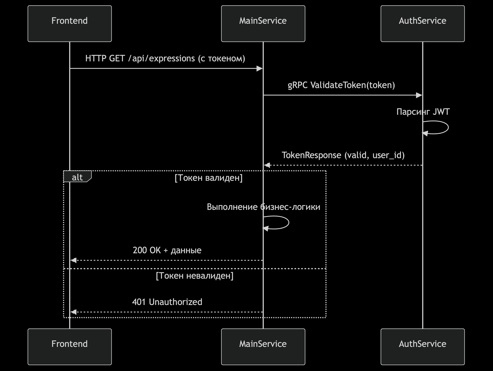

<h1>Распределённый вычислитель арифметических выражений</h1>

<h2>Краткое описание</h2>

Данный сервис может использоваться для различных вычислений в режиме онлайн.

Поддерживаемые операции:

<ol>
  <li>Сложение (+)</li>
  <li>Вычитание (-)</li>
  <li>Умножение (*)</li>
  <li>Деление (/)</li>
  <li>Операции приоритета (скобки)</li>
</ol>

<h2>Схема приложения</h2>
Используется
<ol>
  <li>PostgreSQL для хранения данных о пользователе и выражениях</li>
  <li>Сервис auth отвечает за аутентификацию</li>
  <li>Сервис service выполняет основную бизнес логику с вычислениями</li>
  <li>Сервисы общаются между собой по gRPC</li>
  <li>Агенты общаются с бизнес сервисом по http</li>
  <li>Регресс файл написан на Python - в корне test_application.py</li>
</ol>

<h2>Настройка проекта</h2>
<ol>
  <li>Клонируйте репозиторий.</li>
  <pre><code>git@github.com:Ilya-c4talyst/go_calculator.git</code></pre>
  <li>Установите библиотеки:
    <pre><code>cd service
go mod download
cd auth
go mod download</code></pre>
  </li>
  <li>Создайте в корне проекта файл <code>.env</code> и добавьте в него настройки:
    <pre><code>TIME_ADDITION_MS=1
TIME_SUBTRACTION_MS=1
TIME_MULTIPLICATIONS_MS=1
TIME_DIVISIONS_MS=1
COMPUTING_POWER=2
POSTGRES_USER=username
POSTGRES_PASSWORD=password
POSTGRES_PORT=5432
POSTGRES_NAME=postgres
POSTGRES_HOST=localhost
SECRETKEY=secret_key
env=prom</code></pre>
  </li>
</ol>
<h2>Запуск проекта</h2>

<ul>
Легче всего запустить проекте с помощью докера.
<li>Вариант 1. Сборка образов БД и самих сервисов.
В корне проекта выполните команду <pre><code>docker-compose up -d --build</code></pre>
</li> 
<li>Вариант 2. Сборка образа только БД

Нужно подменить docker-compose.yml на следующий

<pre><code>version: '3.8'

services:
  postgres:
    image: postgres:latest
    container_name: my-postgres
    restart: always
    ports:
      - ${POSTGRES_PORT}:${POSTGRES_PORT}
    environment:
      POSTGRES_USER: ${POSTGRES_USER}
      POSTGRES_PASSWORD: ${POSTGRES_PASSWORD}
      POSTGRES_DB: ${POSTGRES_NAME}
    command:
      - 'postgres'
      - '-c'
      - 'port=${POSTGRES_PORT}'
    volumes:
      - postgres_data:/var/lib/postgresql/data

volumes:
  postgres_data:</code></pre>в .env поменять <pre><code>env=prom на env=dev</code></pre>
Запустить два терминала (в папке auth и service) и в кажом выполнить команду
<pre><code>go run cmd/main.go</code></pre></li> 

<b>После успешного запуска можно открыть в браузере страницу</b>
<pre><code>index.html</code></pre>

и приступить к тестированию

</ul>

<h2>Примеры запросов</h2>

<h3>UI</h3>

В корне проекта находится HTML-страница <code>index.html</code>, с помощью которой можно удобно выполнять описанные ниже запросы.

<h3>Интеграционные тесты</h3>

Регресс файл написан на Python - в корне test_application.py.

<h2>Спецификация API калькулятора арифметических выражений (v2)</h2>

<h2>Аутентификация</h2>

Все запросы к API (кроме /register и /login) требуют JWT-токена в заголовке Authorization.

<h3>Регистрация нового пользователя</h3>

<strong>POST http://localhost:8081/register</strong>

Вход:

<pre><code>{
    "username": "имя пользователя",
    "password": "пароль"
}</code></pre>

На выходе:

<pre><code>{
    "message": "пользователь успешно зарегистрирован"
}</code></pre>

<h3>Вход пользователя</h3>

<strong>POST http://localhost:8081/login</strong>

Вход:

<pre><code>{
    "username": "имя пользователя",
    "password": "пароль"
}</code></pre>

На выходе:

<pre><code>{
    "token": "JWT токен для авторизации"
}</code></pre>

<h2>Основное API (порт 8080)</h2>

Все запросы требуют заголовка Authorization с JWT-токеном.

<h3>Добавление выражения для вычисления</h3>

<strong>POST http://localhost:8080/api/v1/calculate</strong>

Вход:

<pre><code>{
    "expression": "арифметическое выражение"
}</code></pre>

На выходе:

<pre><code>{
    "id": "уникальный идентификатор выражения"
}</code></pre>

<h3>Получение списка всех выражений пользователя</h3>

<strong>GET http://localhost:8080/api/v1/expressions</strong>

На выходе:

<pre><code>{
    "expressions": [
        {
            "id": "идентификатор",
            "expression": "текст выражения",
            "status": "статус (queued/processing/solved/error)",
            "result": "результат (если вычислено)",
        },
    ]
}</code></pre>

<h3>Получение конкретного выражения по ID</h3>

<strong>GET http://localhost:8080/api/v1/expression/:id</strong>

На выходе:

<pre><code>{
    "expression": {
        "id": "идентификатор",
        "expression": "текст выражения",
        "status": "статус",
        "result": "результат",
    }
}</code></pre>

<h2>API для агентов вычисления</h2>

<h3>Получение задачи для вычисления</h3>

<strong>GET http://localhost:8080/api/v1/internal/task</strong>

На выходе:

<pre><code>{
    "id": "идентификатор подвыражения",
    "arg1": "первый аргумент",
    "arg2": "второй аргумент",
    "operation": "код операции (43 для '+', 45 для '-', и т.д.)",
    "operation_time": "время выполнения операции в секундах"
}</code></pre>

<h3>Отправка результата вычисления</h3>

<strong>POST http://localhost:8080/api/v1/internal/task</strong>

Вход:

<pre><code>{
    "id": "идентификатор подвыражения",
    "result": "результат вычисления"
}</code></pre>

<h2>Интерфейс пользователя</h2>

Приложение предоставляет веб-интерфейс с двумя основными разделами:

<h3>1. Аутентификация</h3>
<ul>
    <li>Форма регистрации нового пользователя</li>
    <li>Форма входа существующего пользователя</li>
</ul>

<h3>2. Работа с выражениями</h3>
<ul>
    <li>Добавление нового выражения для вычисления</li>
    <li>Просмотр списка всех выражений пользователя с их статусами</li>
    <li>Просмотр деталей конкретного выражения по ID</li>
</ul>

<h2>Особенности новой версии</h2>
<ul>
    <li>Добавлена система аутентификации пользователей</li>
    <li>Каждый пользователь видит только свои выражения</li>
    <li>В интерфейсе отображается больше информации о выражениях</li>
    <li>Добавлены временные метки создания и завершения вычислений</li>
    <li>Интерфейс стал более удобным и информативным</li>
</ul>

<h2>Разработчик</h2>
<ol>
  <li>Илья Савченко</li>
  <li>c4talyst@yandex.ru</li>
</ol>

<h2>Технологии</h2>
<ol>
  <li>Golang v1.24</li>
  <li>PostgreSQL</li>
  <li>Gin</li>
  <li>JWT</li>
  <li>GORM</li>
</ol>
