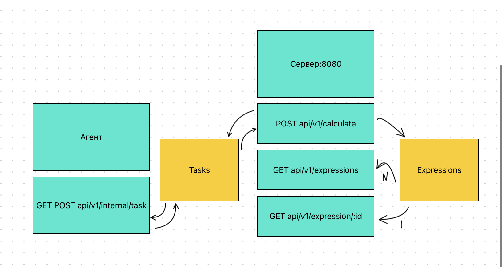

<H1>Калькулятор</H1>

<h2>Краткое описание</h2>
<p>Данный сервис может использоваться для различных вычислений - онлайн.</p>
<p>Поддерживаемые операции.
<ol>
  <li>Сложение(+)</li>
  <li>Вычитание(-)</li>
  <li>Умножение(*)</li>
  <li>Деление(/)</li>
  <li>Операции приоритета - ()</li>
</ol>
</p>

<h2>Настройка проекта</h2>
<ol>
  <li>Клонируем репозиторий</li>
  <li>Устанавливаем зависимость для чтения .env <i>go get github.com/joho/godotenv</i></li>
  <li>Создаем в корне проекта файл .env и прописываем в нем настройки(пример заполнения)
  <ul>
    <li>TIME_ADDITION_MS=1</li>
    <li>TIME_SUBTRACTION_MS=1</li>
    <li>TIME_MULTIPLICATIONS_MS=1</li>
    <li>TIME_DIVISIONS_MS=1</li>
    <li>COMPUTING_POWER=2</li>
  </ul>
  </li>
  <li>Запускаем проект с помощью go run cmd/main.go</li>
</ol>

<h2>Как оно работает</h2>
<p>При запуске приложения стартует сервер, который принимает запросы пользователей, а также агент,
который опрашивает сервер на наличие новых задач. Если таковые есть, то он их обрабатывает и меняет статус 
задачи для выражения</p>


<h2>Примеры запросов</h2>
<h2>Сервер</h2>
<h3>Для запросов рекомендуется использовать программу Postman</h3>
<p>Запускается сервер, который принимает запросы на базовый эндпоинт /api/v1/calculate.
  В body в поле "expression" мы пишем пример и получаем результат о созданной задаче
</p>
<p>POST http://127.0.0.1:8080/api/v1/calculate</p>
<p>Вход:</p>
  ```plaintext
{
    "expression": "выражение"
}
```
<p>На выходе ожидается следующее:</p>
  ```plaintext
{
    "id": ID созданного выражения
}
```

<p>Чтобы увидеть созданные выражения можно перейти по эндпоинту /api/v1/expressions</p>
<p>GET http://127.0.0.1:8080/api/v1/expressions</p>
<p>Вход:</p>
  ```plaintext
{}
```
<p>На выходе ожидается следующее:</p>
  ```plaintext
{
    "expressions": [
        {
            "id": 0,
            "status": "queued",
            "result": "0"
        },
        {
            "id": 1,
            "status": "solved",
            "result": "0"
        }
    ]
}
```

<p>Также можно точечно обратиться к конкретному выражению, добавивID /api/v1/expression:id</p>
<p>GET http://127.0.0.1:8080/api/v1/expression/1</p>
<p>Вход:</p>
  ```plaintext
{}
```
<p>На выходе ожидается следующее:</p>
  ```plaintext
{
    "expression": {
        "id": 1,
        "status": "solved",
        "result": "1.00"
    }
}
```

<p>Также можно точечно обратиться к конкретному выражению, добавивID /api/v1/expression:id</p>
<p>GET http://127.0.0.1:8080/api/v1/expression/1</p>
<p>Вход:</p>
  ```plaintext
{}
```
<p>На выходе ожидается следующее:</p>
  ```plaintext
{
    "expression": {
        "id": 1,
        "status": "solved",
        "result": "1.00"
    }
}
```

<h2>Агент</h2>
Агент работает независимо от пользователя и опрашивает сервер в зависиости от числа воркеров
<p>Получение задачи</p>
<p>GET http://127.0.0.1:8080/api/v1/internal/task</p>
<p>Вход:</p>
  ```plaintext
{}
```
<p>На выходе ожидается следующее:</p>
  ```plaintext
{
    "id": 1,
    "arg1": 1,
    "arg2": 1,
    "operation": 43,
    "operation_time": 1
}
```
<p>Результаты</p>
<p>POST http://127.0.0.1:8080/api/v1/internal/task</p>
<p>Вход:</p>
  ```plaintext
{
  "id": 1,
  "result": 2.00,
}
```


<h2>Тестирование</h2>

<p>Для скриптов calc.go && app.go написаны тесты. Для их запуска нужно перейти в соответствующую директорию и прописать go test -v</p>

<h2>Разработчик</h2>
<ol>
  <li>Илья Савченко</li>
  <li>c4talyst@yandex.ru</li>
</ol>

<h2>Технологии</h2>
<ol>
  <li>Golang v1.22.1</li>
  <li>github.com/joho/godotenv</li>
</ol>
